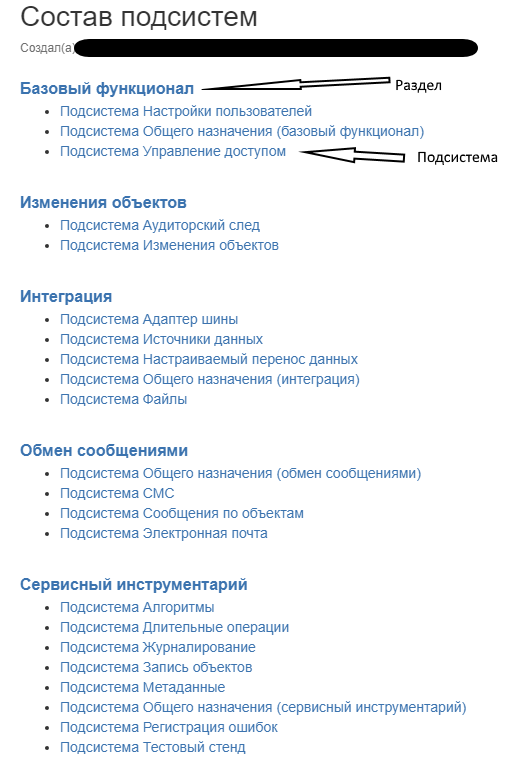
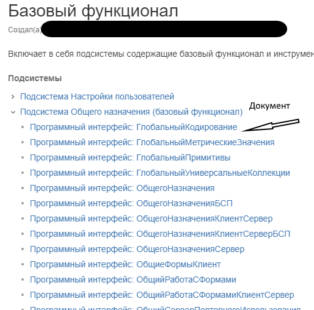
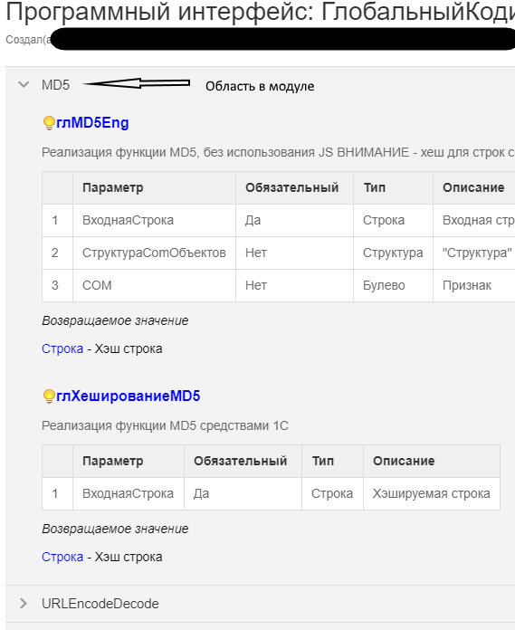
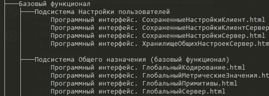
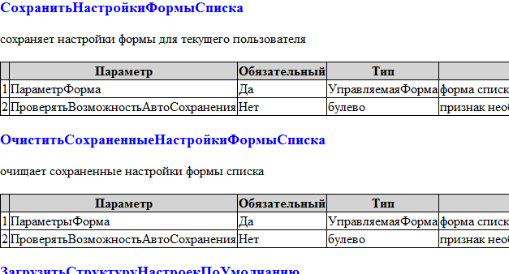

# AutodocGen

Инструмент генерации документации на основании файлов исходных кодов конфигурации 1С:Предприятие.

## Об инструменте

Инструмент позволяет

- автоматически сформировать документацию на основании исходных файлов конфигурации 1С:Предприятие
- выполнить проверку на возможность корректного разбора информации, выступающей исходными данными для документации
- опубликовать сгенерированную документацию

## Установка

Процесс установки стандартен:

- либо `opm install autodocgen`
- либо, если по разным причинам первый способ не подходит, то скачать архив из релизов, распаковать и выполнить (для windows) `installlocalhost.bat`

## Использование

Основные возможности есть в справке. Отдельно стоит обратить внимание на конфигурационный файл.

Конфигурационный файл соответствует структуре единого конфигурационного файла, ниже приведен пример

```json
    {
        "GLOBAL": {
            "КаталогИсходныхФайлов": "src\\configuration",
            "version": "1.0.4"
        },
        "AutodocGen":{
            "НастройкиConluence": {
                "АдресСервера":"https://my-confluence.myhost.ru",
                "Пользователь":"user",
                "Пароль":"password",
                "Пространство":"key",
                "КорневаяСтраница":"Имя кореневой страницы в пространстве key",
                "ПутьКШаблонам": "",
                "АнализироватьТолькоПотомковПодсистемы": "МояКорневаяПодсистема"
            },
            "НастройкиHTML": {
                "ПутьКШаблонам": "",
                "КаталогПубликации": "./doc",
                "АнализироватьТолькоПотомковПодсистемы": "МояКорневаяПодсистема"
            },
            "НастройкиJSON": {
                "ПутьКШаблонам": "",
                "КаталогПубликации": "./json",
                "АнализироватьТолькоПотомковПодсистемы": "МояКорневаяПодсистема"
            },
            "НастройкиMarkdown": {
                "ПутьКШаблонам": "",
                "КаталогПубликации": "./markdown",
                "АнализироватьТолькоПотомковПодсистемы": "МояКорневаяПодсистема"
            },
            "ПоследнийОбработанныйКоммит": ""
        }
    }
```

Располагать конфигурационный файл нужно в корне репозитория под именем `v8config.json`.

## Поддерживаемые варианты генерации автодокументации

Как видно из пример конфигурационного файла, поддерживаются 2 формата (ключ `-format`)

- `confluence` - генерация страниц в указанном пространстве [confluence](https://ru.atlassian.com/software/confluence)
- `html` - генерация структуры каталогов в соответствии с подсистемами и файлов-страниц в каталогах.
- `json` - генерация структуры каталогов в соответствии с подсистемами и json файлов в каталогах.
- `markdown` - генерация структуры каталогов в соответствии с подсистемами и markdown файлов в каталогах.

Для добавления новых стоит воспользоваться шаблоном [src/Классы/ШаблонГенераторДокументации.os-template](src/Классы/ШаблонГенераторДокументации.os-template)

## Шаблоны

1. ШаблонСплиттерНачало - Начало области, раздела, подсистемы. Шаблон: %1 - Имя области
2. ШаблонСплиттерКонец - Окончание области, раздела, подсистемы.
3. ШаблонЗаголовок - Заголовок метода. Шаблон: %1 - Имя метода
4. ШаблонЗаголовокДляКонстант - Заголовок раздела констант. Шаблон: %1 - Имя раздела
5. ШаблонШапкаТЧ - Шапка списка параметров метода
6. ШаблонШапкаТЧДляКонстант - Шапка списка констант
7. ШаблонСтрокаТЧ - Строка описания параметра.
   Шаблон:
   - %1 - номер
   - %2 - имя
   - %3 - обязательный
   - %4 - тип параметра
   - %5 - описание параметра

8. ШаблонСтрокаТЧДляКонстант - Строка описания константы.
   Шаблон:
   - %1 - имя
   - %2 - тип параметра
   - %3 - описание параметра
9. ШаблонПодвалТЧ - Подвал списка параметров метода и констант
10. ШаблонВозврат - Описание возвращаемого методов значения. Шаблон: %1 - тип, %2 - описание
11. ШаблонОписание - Описание метода. Шаблон: %1 - текст описания
12. ШаблонПример - Пример использования метода. Шаблон: %1 - текст примера
13. ШаблонНачалоСтраницы - Начало страницы документации. Шаблон: %1 - Имя страницы
14. ШаблонКонецСтраницы - Окончание страницы документации

## Подготовка конфигурации

Для генерации документации конфигурация должна соответствовать требованиям:

- Все модули должны иметь определенную структуру областей (в соответствии с требованиями 1С)
- В документацию добавляются только экспортные методы, находящиеся в разделе `ПрограммныйИнтерфейс`
- Описание методов должно соответствовать требованиям оформления кода
- Поддерживаются общие модули и модули менеджеров объектов
- Все модули / объекты, которые попадают под правила автодокументирования, должны располагаться в соответствующих подсистемах. Принятая структура:

``` none
    Подсистемы конфигурации
    |
    +-- МояКорневаяПодсистема (не выводится в интерфейс пользователя)
        |
        +-- Раздел
            |
            +-- Подсистема
                |
                +-- ОбъектМетаданных

```

## Примеры

### В формате Confluence







### В Формате HTML





## Лицензии и права

- основная лицензия исходного кода продукта - [MIT](LICENSE)
- лицензии стороннего кода - BSDv3, Apache License, Freeware, etc - подробные разъяснения лицензий на исходный код продукта и его документации в том числе содержатся внутри файлов исходного кода

TODO:
1. Публикация документации в формате Markdown и каталога  doc, иерархия каталогов = иерархии подсистем (начиная с корневой)
2. В каталоге doc предусмотреть обработку index.md - описание подсистемы
3. Команда проверки исходников
4. Проверка исходников по списку файлов